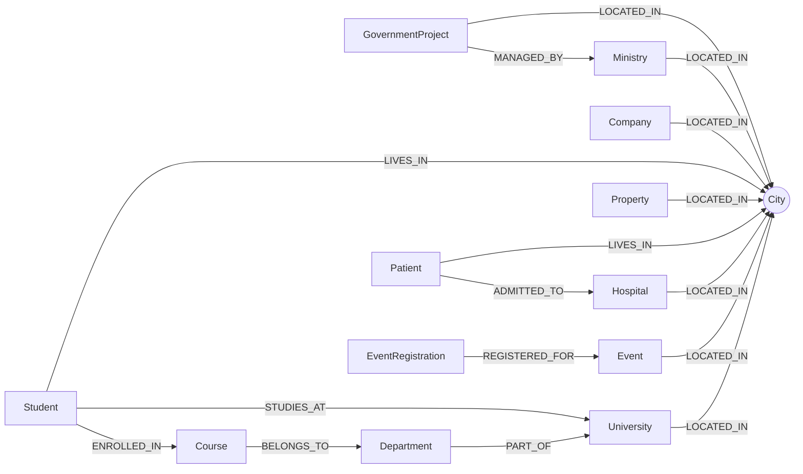

# Neo4j KRG Graph Database

A graduate-level Advanced Database Systems project that models a multi-domain KRG
open-data scenario as a connected Neo4j graph. The repository includes the source
CSV files, Cypher loading workflow, visual analysis tasks, exported graph results,
and final report/presentation deliverables.

## Project Summary

| Item | Details |
|---|---|
| Project title | Neo4j Graph Database Implementation for KRG Open Data |
| Institution | American University of Kurdistan, Duhok |
| Program | MSc in Artificial Intelligence |
| Course | Advanced Database Systems - 101 |
| Instructor | Dr. Shamal AL-Dohuki |
| Team | Sawab Hussein, Mohammed Salah, Asmaa Salih |
| Date | April 2026 |
| DBMS | Neo4j |
| Query language | Cypher |

## What This Repository Contains

- A 13-table CSV dataset with 1,000 records per table.
- Neo4j `LOAD CSV` scripts for creating indexes, nodes, and relationships.
- A city-centered graph model connecting education, healthcare, government,
  business, property, and events.
- Ten visual Cypher analysis tasks with exported Neo4j graph screenshots.
- A polished LaTeX report and PowerPoint presentation.
- A submission-ready folder containing the final presentation PDF and PPTX.

## Repository Structure

```text
ADB_GroupProject/
|-- ADB_GroupProject_Submission/
|   |-- Neo4j_KRG_Graph_Database_Presentation.pdf
|   `-- Neo4j_KRG_Graph_Database_Presentation.pptx
|-- csv_tables_1000/
|   |-- companies.csv
|   |-- courses.csv
|   |-- departments.csv
|   |-- enrollments_1000.csv
|   |-- events.csv
|   |-- event_registrations_1000.csv
|   |-- government_projects.csv
|   |-- hospitals.csv
|   |-- ministries.csv
|   |-- patients_1000.csv
|   |-- properties.csv
|   |-- students.csv
|   `-- universities.csv
|-- docs/
|   |-- Neo4j_KRG_Graph_Database_Presentation.pptx
|   `-- LaTeX_Report/
|       |-- report.tex
|       |-- report.pdf
|       |-- appendix_generated.tex
|       |-- AUK-logo.png
|       |-- city_stress_index.csv
|       |-- appendix_code/
|       |   |-- fetching_data_*.cypher
|       |   |-- visual_tasks_*.cypher
|       |   `-- visual_tasks_*.txt
|       `-- figures/
|           `-- task*.png
|-- query_results/
|   |-- *.png
|   `-- 9. City Stress Index Graph (FULL).csv
|-- 10_Neo4j_Visual_Tasks.md
|-- assignment_instructions.txt
|-- fetching_data.md
|-- summary.md
`-- README.md
```

## Dataset Overview

The dataset contains 13,000 source records across five connected domains. Each
CSV file contains 1,000 rows.

| Domain | Tables | Main entities |
|---|---:|---|
| Education | 5 | Universities, departments, courses, students, enrollments |
| Healthcare | 2 | Hospitals, patients |
| Government | 2 | Ministries, government projects |
| Business and property | 2 | Companies, real estate properties |
| Events | 2 | Events, event registrations |

For the full table-level schema, record counts, and feature names, see
[`summary.md`](summary.md).

## Graph Model

`City` is the central integration node in the model. It connects records from all
major domains, making it possible to analyze shared geographic pressure,
cross-city movement, administrative reach, and public-service relationships.



## Neo4j Build Workflow

The complete loading script is documented in [`fetching_data.md`](fetching_data.md).

1. Create or open a Neo4j database.
2. Copy all files from `csv_tables_1000/` into the database `import/` directory.
3. Run Step 1 in `fetching_data.md` to create indexes.
4. Run Step 2 to load all node labels.
5. Run Step 3 to create relationships.
6. Run Step 4 to verify the graph.
7. Explore the analysis queries in [`10_Neo4j_Visual_Tasks.md`](10_Neo4j_Visual_Tasks.md).

Because the Cypher scripts use `file:///...` paths, the CSV files must be placed
inside Neo4j's configured import directory before running the queries.

## Visual Analysis Tasks

The project includes ten presentation-ready graph queries:

| # | Analysis task | Main question |
|---:|---|---|
| 1 | City as a Central Multi-Sector Hub | Which cities connect the most domains? |
| 2 | Patient and Hospital Movement | Are patients treated locally or across cities? |
| 3 | Government Project Network | Which ministries control projects in which cities? |
| 4 | Cross-City Student Mobility | Which students study outside their home city? |
| 5 | Full Academic Path for Students | How do students connect to courses, departments, universities, and cities? |
| 6 | Event Registrations and Their Cities | Where is event registration activity concentrated? |
| 7 | Cross-City Healthcare Referral Network | Which healthcare paths cross city boundaries? |
| 8 | Ministry Cross-City Project Control | How far does each ministry's project control extend? |
| 9 | City Stress Index Graph | Which cities show combined service, event, and property pressure? |
| 10 | Public Investment and Property Market Pressure | How do public projects relate to property-market pressure? |

Query definitions are in [`10_Neo4j_Visual_Tasks.md`](10_Neo4j_Visual_Tasks.md).
Exported screenshots and the city stress CSV are stored in [`query_results/`](query_results/).

## Deliverables

| Deliverable | Location |
|---|---|
| Final report PDF | [`docs/LaTeX_Report/report.pdf`](docs/LaTeX_Report/report.pdf) |
| Report source | [`docs/LaTeX_Report/report.tex`](docs/LaTeX_Report/report.tex) |
| Presentation deck | [`docs/Neo4j_KRG_Graph_Database_Presentation.pptx`](docs/Neo4j_KRG_Graph_Database_Presentation.pptx) |
| Submission PDF and PPTX | [`ADB_GroupProject_Submission/`](ADB_GroupProject_Submission/) |
| Exported graph figures | [`docs/LaTeX_Report/figures/`](docs/LaTeX_Report/figures/) |
| Standalone query result exports | [`query_results/`](query_results/) |
| Appendix Cypher files | [`docs/LaTeX_Report/appendix_code/`](docs/LaTeX_Report/appendix_code/) |

## Implementation Notes

- Indexes are created before relationship loading to improve lookup performance.
- Nodes are loaded with `MERGE`, making the import process repeatable.
- Numeric fields are converted during import with `toInteger()` and `toFloat()`.
- Relationship creation is batched with `IN TRANSACTIONS OF 500 ROWS`.
- The report appendix preserves the generated Cypher blocks used for loading,
  verification, and visual analysis.

## Recommended Reading Order

1. [`summary.md`](summary.md) - dataset inventory and field-level overview.
2. [`fetching_data.md`](fetching_data.md) - Neo4j import and relationship workflow.
3. [`10_Neo4j_Visual_Tasks.md`](10_Neo4j_Visual_Tasks.md) - visual analysis queries.
4. [`docs/LaTeX_Report/report.pdf`](docs/LaTeX_Report/report.pdf) - final written report.
5. [`ADB_GroupProject_Submission/`](ADB_GroupProject_Submission/) - presentation-ready files.

## Academic Context

This repository was prepared for academic coursework at the American University
of Kurdistan. Reuse should preserve attribution to the project team and course
context.
